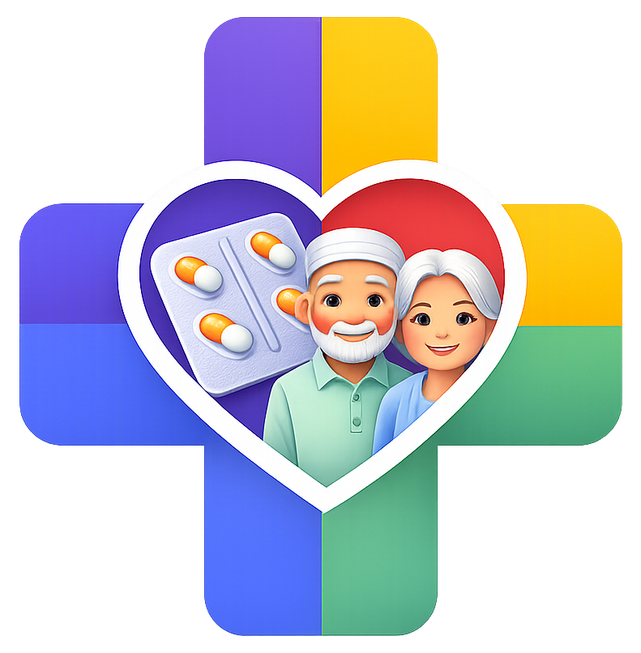
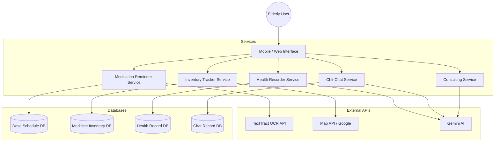

<div align="center">
  
</div>

# Ingatkan Teman: The Companion Elderly Needs

A web-based and mobile-first prototype by **Team KATSPAW** that brings personalized health management and AI-driven companionship to elderly users in Malaysia. The app uses friendly family personas to make medication tracking, health recording, and daily conversations feel natural, caring, and reliable.


Healthcare management for the elderly shouldn't feel like navigating a complex spreadsheet.
**Ingatkan Teman** makes health management accessible through an intuitive, character-based conversational interface that feels like talking to trusted family members and professionals.

---

## Table of Contents

- [Problem Statement](#problem-statement)
- [Our Solution](#our-solution)
- [Core Features](#core-features)
- [Demo Surfaces](#demo-surfaces)
- [Demo and Screenshots](#demo-and-screenshots)
- [Architecture](#architecture)
- [Tech Stack](#tech-stack)
- [How to Install and Run](#how-to-install-and-run)
- [API Overview](#api-overview)
- [Testing](#testing)
- [Current Prototype Status](#current-prototype-status)
- [Team](#team)
- [Known Limitations](#known-limitations)
- [Why This Matters](#why-this-matters)

## Problem Statement

Malaysia is rapidly becoming an aging nation, with the percentage of citizens aged 60 and above expected to reach 15.3% by 2030. Elderly individuals often struggle with managing multiple medications, keeping track of their daily health metrics (like blood pressure and sugar levels), and can sometimes experience loneliness.

Existing applications are often too clinical, manual, or fragmented. They rely heavily on digital literacy, which is often low among the elderly, making it harder for them to use complex technology interfaces.

Our interpretation is simple:

- Health tracking should feel like a conversation, not a data entry task.
- Medication reminders should be automated through OCR rather than manual typing.
- Elderly users need both lighthearted companionship and serious, reliable consultation.
- The interface must be simple, readable, and perfectly tailored for older adults.

## Our Solution

**Ingatkan Teman** is an AI-powered Medication and Health Reminder Application specifically designed for elderly users. Instead of forcing seniors to navigate complex forms, the app introduces an AI-powered conversational approach.

The app uses five key AI "personas," each acting as a friendly family member or health professional:

1. **Adik Ahmad (The Grandson):** Manages medication reminders using OCR.
2. **PakCik Firdaus (The Uncle):** Tracks inventory and helps locate nearby pharmacies.
3. **Dr. Fatimah & Nurse Alia:** Records daily health metrics and provides insights.
4. **Adik Aisyah (The Granddaughter):** Provides warm, emotional companionship and chit-chat.
5. **Encik Amirul (The Consultant):** Offers reliable consultation for physical and mental wellbeing.

## Core Features

| Feature / Persona                         | What it does                                                                                                                              | User value                                                                   |
| ----------------------------------------- | ----------------------------------------------------------------------------------------------------------------------------------------- | ---------------------------------------------------------------------------- |
| **Medication Reminder** _(Adik Ahmad)_    | Uses AI-powered text extraction (OCR) to read clinic prescriptions, validates data with the user, and schedules notifications.            | Removes the hassle of manual entry and ensures correct medication schedules. |
| **Inventory Tracker** _(PakCik Firdaus)_  | Deducts pill counts automatically upon confirming intake. Notifies when stocks are low and displays nearby pharmacies on an embedded map. | Prevents running out of essential medications and simplifies restocking.     |
| **Daily Health Recorder** _(Dr. Fatimah)_ | Conversational interface to log daily metrics (heart rate, blood sugar). Generates reports and insights on health trends.                 | Makes health logging natural and provides actionable, structured insights.   |
| **Companionship Chat** _(Adik Aisyah)_    | An AI chatbot tuned to act like a caring granddaughter. Initiates conversations and asks about the user's day proactively.                | Reduces loneliness and encourages daily engagement with a warm persona.      |
| **Consultation** _(Encik Amirul)_         | A calm, reliable AI consultant for discussing physical or mental health concerns. Extracts key entities and generates session reports.    | Provides a safe, private space for serious health discussions and triage.    |

## Demo Surfaces

The implemented prototype includes:

| Surface                    | Status      | Entry point                                                  |
| -------------------------- | ----------- | ------------------------------------------------------------ |
| **FaceID Login Simulator** | Implemented | Opens on app launch (`index.html`)                           |
| **Home Dashboard**         | Implemented | Main navigation hub after login                              |
| **Medication Reminder**    | Implemented | Home > Medication (Scan OCR or manual entry)                 |
| **Inventory Tracker**      | Implemented | Home > Inventory (Manage stock, view pharmacies)             |
| **Daily Health Chat**      | Implemented | Home > Health (Chat with Dr. Fatimah)                        |
| **Chit-Chat & Consultant** | Implemented | Home > Chat / Consult (Chat with Adik Aisyah / Encik Amirul) |

## Demo and Screenshots

Here are the key personas that guide the elderly users through the application:

|            Adik Ahmad (Medication)             |             PakCik Firdaus (Inventory)             |              Dr. Fatimah (Health)              |             Adik Aisya (Chit-Chat)             |              Encik Amirul (Consult)              |
| :--------------------------------------------: | :------------------------------------------------: | :--------------------------------------------: | :--------------------------------------------: | :----------------------------------------------: |
|  |  |  |  |  |

_(Note: Please refer to [Diagrams and Demo file](https://github.com/nayzinminlwin/Ingatkan_Teman_App/blob/master/docs/IngatkanTeman_Diagrams_n_Demo.pdf) for detailed visuals.)_

Live demo at : [Ingatkan Teman Web](https://nayzinminlwin.github.io/Ingatkan_Teman_App/)

password: type any digit

## Architecture

The system utilizes a service-oriented architecture connecting the frontend interface to specific AI services and databases.



## Tech Stack

- **Frontend:** HTML5, CSS3 (Modular Styles), Vanilla JavaScript
- **Backend Environment:** Node.js
- **Database:** Oracle Database (via `oracledb` npm package)
- **AI & Integrations:**
  - OCR API for Prescription Scanning
  - Gemini API for Conversational UI & Natural Language Processing
  - Map APIs for Pharmacy Locator
- **Architecture Standard:** Progressive Web App (PWA) ready (`manifest.json` configured)

## How to Install and Run

1. **Clone the repository:**
   ```bash
   git clone <repository-url>
   cd Ingatkan_Teman_App
   ```
2. **Install dependencies:**
   ```bash
   npm install
   ```
3. **Configure Environment:**
   - Ensure you have Oracle DB credentials configured.
   - Place your AI API keys in the respective configuration files inside `ai_ConfigFiles/`.
4. **Run the App:**
   - Since this is primarily a Web MVP, you can open `index.html` in any modern browser, or serve it using a local development server:
   ```bash
   npx serve .
   ```

## API Overview

The application heavily relies on several key APIs to power its features:

- **Optical Character Recognition (OCR) API:** Used in the Medication Reminder to extract text from photos of prescriptions or medicine labels.
- **Large Language Model (LLM) API:** Used across Health Recorder, Chit-Chat, and Consulting modules to process natural language, parse health metrics from casual speech, and generate empathetic persona-driven responses.
- **Map / Geolocation API:** Used by the Inventory Tracker to render maps and find nearby pharmacies when stock is low.

## Testing

The system is designed with testability in mind. Current testing strategies include:

- **Unit Testing:** Basic functional tests for core logic (e.g., inventory deduction math, schedule timing).
- **UI/UX Testing:** Manual testing focuses on large typography, high contrast, and easy touch targets suited for the elderly.
- **AI Prompt Validation:** Manual verification that personas stay in character and do not provide unauthorized medical advice.

## Current Prototype Status

**Status: Demo Ready (Web MVP)**

- The frontend interface and character personas are fully built using HTML/CSS/JS.
- Navigation flows between Medication, Inventory, Health, Chat, and Consulting are functional.
- The `oracledb` connection is set up for backend persistence.
- _Next Steps:_ Full migration to Flutter for native mobile deployment as outlined in the SDD.

## Team

**Team KATSPAW**

- [**Nay Zin @ Alex**](https://github.com/nayzinminlwin) - Team Leader, Backend Logic, Design Architecture
- [**Nur Imanina Zafirah**](https://github.com/fyrahhhhh) - UI/UX Design, Documentation
- [**Nurul Izzah**](https://github.com/Ityzzzzzzz) - Project Documentation, Coordination
- [**Dawood**](https://github.com/dawoodnadeem) - Project Manager, Coordination
- [**Fawzia**](https://github.com/fawziamoradi) - Project Presenter, Management
- [**Sumayyah**](https://github.com/sumayyah) - Technical Writer, Research

_Project developed for SSW3001: Software Engineering (UPM)_

## Known Limitations

- **Offline Mode:** While the UI is accessible, AI conversational features and OCR scanning require an active internet connection to function.
- **Diagnostic Boundaries:** The AI (Dr. Fatimah / Encik Amirul) is strictly constrained from providing medical diagnoses. It only records and triages information.
- **Hardware Dependencies:** The OCR feature requires a decent quality smartphone camera for accurate prescription parsing.

## Why This Matters

By disguising complex health management tasks behind friendly, familiar personas, **Ingatkan Teman** lowers the technological barrier for elderly users. It transforms a clinical chore into a daily interaction with a "virtual family", ensuring that our elders stay healthy, medicated, and socially engaged without feeling overwhelmed by modern technology.
