# Software Design Document

## for 'Ingatkan Teman' Project

**Version 1.0**

Prepared by Group KATSPAW
Prepared for Puan Tan Ming Ming
FSKTM, University Putra Malaysia
11th Jan 2026

---

## Revision History

| Version | Name | Date | Reason For Changes |
|---|---|---|---|
| 1.0 | First Draft | 11.1.2026 | Initial Version |

---

## Table of Contents

1. [Introduction](#1-introduction)
   - 1.1 [Purpose](#11-purpose)
   - 1.2 [Scope](#12-scope)
   - 1.3 [Overview](#13-overview)
   - 1.4 [Definitions and Acronyms](#14-definitions-and-acronyms)
2. [System of Requirements](#20-system-of-requirements)
   - 2.1 [Functional Requirements](#21-functional-requirements)
   - 2.2 [Non-Functional Requirements](#22-non-functional-requirements)
3. [Functional Requirements Specifications](#30-functional-requirements-specifications)
   - 3.1 [Use Cases for Medication Reminder](#31-use-cases-medication-reminder)
   - 3.2 [Use Cases for Medication Inventory Tracker](#32-uses-case-medication-inventory-tracker)
   - 3.3 [Use Cases for Daily Health Recorder](#33-use-cases-daily-health-recorder)
   - 3.4 [Use Cases for Chit-Chat](#34-use-cases-chit-chat)
   - 3.5 [Use Cases for Consulting](#35-use-cases-consulting)
4. [Design Consideration](#40-design-consideration)
   - 4.1 [Assumptions and Dependencies](#41-assumptions-and-dependencies)
   - 4.2 [General Constraints](#42-general-constraints)
   - 4.3 [Goals and Guidelines](#43-goals-and-guidelines)
   - 4.4 [Development Method](#44-development-method)
5. [Architectural Strategies](#50-architectural-strategies)
   - 5.1 [System Architecture](#51-system-architecture-deployment-diagram)
   - 5.2 [Component Diagram](#52-component-diagram)
6. [Detail Design](#60-detail-design-the-core-coding-guide)
   - 6.1 [Class Diagram](#61-class-diagram)
   - 6.2 [Sequence Diagrams](#62-sequence-diagrams)
   - 6.3 [User Interface](#63-user-interface-design)
7. [Glossary](#70-glossary)

---

## 1.0 INTRODUCTION

### 1.1 Purpose

This Software Design Document (SDD) is prepared to describe the technical design and implementation plan for the Ingatkan Teman mobile application. While the Software Requirements Specification (SRS) explains what the system must do, this document focuses on how the system will be designed and developed to meet those requirements.

The purpose of this SDD is to provide a clear design reference for developers, project members, and evaluators by explaining the system structure, design considerations, and development approach. It serves as a blueprint that guides the implementation of the application, including the user interface design, system modules, AI components, and supporting technologies.

### 1.2 Scope

The scope of this document covers the design of the Ingatkan Teman mobile application, which is developed for Android and iOS platforms. The system is designed as a standalone mobile application supported by a backend AI engine and cloud-based data storage.

This document focuses on the design of the main application components, including medication reminders, medication inventory tracking, daily health recording, emotional support through AI chat, and consultation support. It also outlines design constraints, assumptions, development methods, and system guidelines. Features or functionalities outside the approved proposal and SRS are not included in this document.

### 1.3 Overview

Ingatkan Teman is an AI-powered mobile application designed to assist elderly users in managing their daily medication, monitoring health conditions, and maintaining emotional well-being. The system uses friendly AI personas that act like family members to make interactions more comfortable and less intimidating for elderly users.

The application consists of five main modules:

1. **Medication Reminder** – helps users remind and confirm their medication intake.
2. **Medication Inventory Tracker** – monitors medicine stock levels and alerts users before supplies run low.
3. **Daily Health Recorder** – allows users to log and review daily health readings through simple interactions.
4. **Chit-Chat** – provides emotional support and companionship through casual conversation.
5. **Consulting** – offers structured, non-diagnostic guidance and generates shareable consultation summaries.

Together, these modules form a supportive system that promotes independence, safety, and well-being for elderly users.

### 1.4 Definitions and Acronyms

| Term / Acronym | Description |
|---|---|
| AI (Artificial Intelligence) | Computer-based intelligence used to simulate human-like conversation and assistance. |
| OCR (Optical Character Recognition) | Technology used to convert text from images, such as prescriptions, into digital text. |
| SDD (Software Design Document) | A document that explains how a software system will be designed and implemented. |
| SRS (Software Requirements Specification) | A document that defines what a software system is required to do. |
| Persona | A fictional character used to guide the tone and behaviour of the AI assistant. |
| TTS (Text-to-Speech) | A feature that converts written text into spoken voice output. |
| API (Application Programming Interface) | A set of rules that allows software components to communicate with each other. |

---

## 2.0 SYSTEM OF REQUIREMENTS

This section describes the system requirements from a design perspective. It translates the approved requirements in the SRS into a clear description of how the system behaves and what is expected from the system at runtime. The requirements are divided into functional and non-functional requirements.

### 2.1 Functional Requirements

The Ingatkan Teman application is designed around five main AI-assisted modules, each represented by a friendly persona. From a system design point of view, the functional requirements define how user inputs are processed and how the system responds.

**Medication Reminder (Adik Ahmad)**
- **Input:** Prescription image, manual medication details, user confirmation, reminder actions (Taken / Snooze / Skip).
- **Processing:** The system uses OCR and AI parsing to extract medication information, stores confirmed schedules, and triggers reminders at scheduled times.
- **Output:** Push notifications, in-app reminders, medication history records, and inventory updates.

**Medication Inventory Tracker (PakCik Firdaus)**
- **Input:** Initial medicine stock, manual inventory updates, medication intake records.
- **Processing:** The system automatically deducts inventory when a dose is confirmed, calculates remaining supply days, and checks against low-stock thresholds.
- **Output:** Low-stock alerts, inventory summaries, pharmacy map display, and exportable shopping lists.

**Daily Health Recorder (Dr. Fatimah & Nurse Alia)**
- **Input:** Health readings entered by voice, text, manual input, or connected devices.
- **Processing:** AI-based natural language processing converts user input into structured health records and analyzes trends over time.
- **Output:** Health history logs, visual charts, alerts for abnormal readings, and exportable health reports.

**Chit-Chat (Adik Aisya)**
- **Input:** Casual text or voice messages, quick replies, emotional expressions.
- **Processing:** The AI engine generates empathetic responses using stored preferences and conversation context.
- **Output:** Friendly conversational replies, emotional support messages, and gentle prompts linking to other modules when appropriate.

**Consulting (Encik Amirul)**
- **Input:** User-described health or well-being concerns.
- **Processing:** The system structures conversations into consultation sessions, identifies key issues, and applies rule-based safety checks.
- **Output:** Consultation summaries, urgency indicators, recommendations for next steps, and exportable session reports.

### 2.2 Non-Functional Requirements

Non-functional requirements define the quality, performance, safety, and usability standards that the system must meet. These requirements ensure the application is reliable, secure, and suitable for elderly users.

**Performance and Responsiveness**
- The application should launch quickly and respond smoothly to user actions.
- Important actions such as marking medication as "Taken" must be reflected immediately in the interface.
- AI responses should appear within a reasonable time to maintain a natural conversational flow.

**Offline Reliability**
- Core features such as viewing medication schedules and recording doses must work even without an internet connection.
- Data entered while offline must be synchronized automatically once connectivity is restored.

**Notification Timeliness**
- Medication reminders and low-stock alerts must be delivered at the correct scheduled times.
- Emergency or critical alerts must be prioritized and displayed clearly.

**Security and Privacy**
- Sensitive user and health data must be protected and shared only with explicit user consent.
- Caregiver access is controlled and can be revoked by the user at any time.

**Usability and Accessibility**
- The interface must be senior-friendly, using large text, clear buttons, and simple navigation.
- Optional text-to-speech support is provided for users with reading difficulties.

**Data Backup and Maintainability**
- The system supports data backup and restoration to prevent data loss.
- The design follows a modular structure to make future updates and maintenance easier for developers.

---

## 3.0 FUNCTIONAL REQUIREMENTS SPECIFICATIONS

### 3.1 Use Cases Medication Reminder

**The Actors**
- **Primary Actor:** The Elderly User
- **Secondary Actor:** The Caregiver (Child/Nurse) and the AI

#### Part A: Medication Reminder Description

**Adding Medication to the Reminder Schedule**
To begin setting up medication reminders, the elderly user accesses the Medication Reminder feature from the main application screen. Adik Ahmad appears to assist the user throughout the process. The user may choose to scan a prescription or medication list using the phone's camera. Once the image is captured, the system identifies the relevant medication details and presents them in a clear review screen. The user is given the opportunity to adjust any information before saving the schedule.

**Medication Reminder Notification**
At the scheduled medication time, the application delivers a reminder notification to the user's device. When the user opens the app, the reminder screen displays the medicine details along with a calm message from Adik Ahmad, encouraging the user to take the medication as planned.

**Confirming Medication Intake**
After taking the medicine, the user confirms the action by selecting the "Taken" option. The system records the intake time and updates the medication log automatically. A short confirmation message from Adik Ahmad reassures the user that the action has been successfully saved.

**Handling Missed or Delayed Medication**
In situations where the user cannot take the medication immediately, they may choose to delay or skip the dose. The system records this selection without issuing warnings or pressure. Adik Ahmad responds in a supportive manner, maintaining a stress-free user experience.

**Caregiver Awareness**
If medication reminders are frequently missed, the system can inform the caregiver, provided permission has been granted. This feature allows caregivers to remain aware of the user's medication routine and offer assistance when necessary.

#### Part B: Use Case Diagram

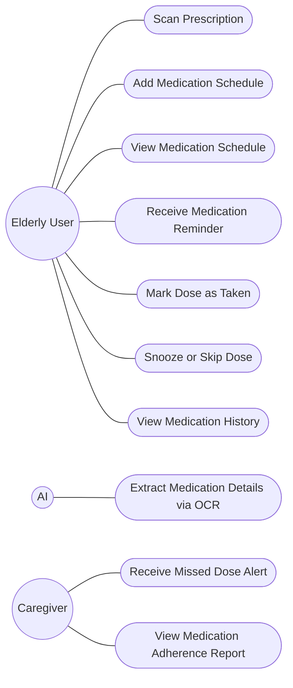
*Figure 3.1.0 : Use Case Diagram of Medication Reminder Feature*

### 3.2 Uses Case Medication Inventory Tracker

**The Actors**
- **Primary Actor:** The Elderly User.
- **Secondary Actor:** The Caregiver (Child/Nurse) and the System.

#### Part A: Medication Inventory Tracker Description

**Adding a New Medicine to Inventory**
Pak Cik Firdaus gently guides the user through adding a new medication to their stock. The user opens the Inventory section, taps "Add Medicine," and enters details such as name, dosage, current quantity, and expiry date. Pak Cik Firdaus confirms the entry with a friendly message and updates the inventory list.

**Logging a Taken Dose and Updating Stock**
After marking a dose as "Taken" in the Medication Reminder, the system automatically deducts one unit from that medicine's stock. PakCik Firdaus updates the remaining count seamlessly in the background, ensuring the inventory is always accurate.

**Low Stock Alert and Pharmacy Search**
When the stock of a medicine falls below a user-set threshold, PakCik Firdaus sends a gentle push notification. The user opens the Low-Stock Dashboard, sees the list of medicines running low, and taps "Find Pharmacies." The app displays a map with nearby pharmacies, complete with distance, travel time, and contact details.

**Manual Stock Adjustment**
If the user buys more medicine or disposes of expired stock, they can manually adjust the quantity in the Inventory screen. PakCik Firdaus asks for a reason for the adjustment and logs it in an audit trail to maintain transparency and accuracy.

**Exporting a Shopping List**
From the Low-Stock Dashboard, the user can generate a shopping list for refills. PakCik Firdaus compiles the list with medicine names and required quantities, which can be exported as a PDF or CSV to share with caregivers or take to the pharmacy.

#### Part B: Use Case Diagram

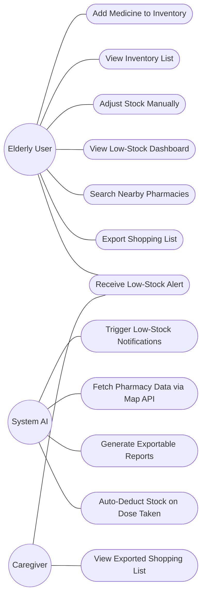
*Figure 3.2.0 : Use Case Diagram of Medication Inventory Tracker Feature*

### 3.3 Use Cases Daily Health Recorder

**The Actors**
1. **Primary Actor:** The Elderly User (Atuk/Nenek).
2. **Secondary Actor:** Dr. Fatimah (AI), Nurse Alia (AI), Caregiver

#### Part A: Daily Health Recorder Description

**Conversational Health Check-in**
At a scheduled time in the morning, Atuk hears a friendly greeting from Dr. Fatimah asks how he is feeling today and whether he has checked his health readings. Atuk replies by speaking naturally, saying his blood sugar level and mentioning that he feels slightly tired. Nurse Alia listens quietly and then gently asks a follow-up question to confirm the number. Once Atuk agrees, the system saves the information into his daily health record. Later, his child can view the updated health log and see how Atuk is doing.

**Automatic Health Record Creation**
After Atuk shares his health reading, the app quietly understands what he said. It recognizes the type of reading, the number, and the time it was taken. When something is unclear, the app politely asks Atuk to confirm before saving it. Once confirmed, the information is neatly stored as today's health record without Atuk needing to type anything.

**Manual or Device Health Entry**
On another day, Atuk prefers not to speak and chooses to type his blood pressure reading instead. Sometimes, his smartwatch sends the reading automatically to the app. Atuk checks the information, makes a small edit if needed, and saves it. The app adds the reading to his daily record so nothing is missed.

**Viewing Health Reports and Insights**
At the end of the week, Atuk opens the app to see how her health has been going. Dr. Fatimah shows him simple charts and friendly messages explaining whether his readings are improving, staying stable, or getting worse. The app compares this week's results with last week and highlights positive changes. With one tap, Atuk's child or nurse can also view or download the health report to help with care decisions.

**Receiving Health Alerts and Recommendations**
One day after Atuk shares his blood sugar reading, Nurse Alia notices that the number is higher than normal. A gentle alert appears on the screen explaining that the reading may need attention. Nurse Alia suggests simple next steps, such as retesting later or visiting the clinic. She also politely asks Atuk if he would like his caregiver to be notified. If Atuk agrees, the system sends the alert and health details to his child or nurse so they can follow up.

**Searching and Reviewing Health History**
When Atuk wants to check her past health records, he opens the history section of the app. He scrolls through a simple timeline showing his daily readings. Atuk can filter the list to see only certain readings, such as fasting blood sugar. For each day, he can also view short conversation snippets that remind him what he told Dr. Fatimah, alongside the saved numbers. His caregiver can use the same view to quickly understand his health patterns over time.

#### Part B: Use Case Diagram

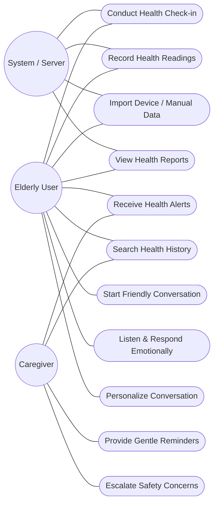
*Figure 3.3.1 - Use cases diagram of Daily Health Recorder*

### 3.4 Use Cases Chit-Chat

**The Actors**
1. **Primary Actor:** The Elderly User (Atuk/Nenek).
2. **Secondary Actor:** Adik Aisya (AI).

#### Part A: Description Chit-Chat by Adik Aisya

**Proactive Friendly Conversation**
At a quiet time in the afternoon, Adik Aisya pops up on Datuk's phone with a cheerful greeting. She talks like a loving granddaughter and starts with a light message, sharing something simple and friendly. Datuk smiles and replies, feeling happy that someone checked in on him. The short conversation makes Datuk feel less lonely and more connected.

**Listening and Emotional Engagement**
Nenek begins telling Adik Aisya about her day and shares a memory from the past. Adik Aisya listens patiently, responds with curiosity, and asks gentle follow-up questions. She gives words of encouragement and reacts warmly, just like a caring granddaughter would. Nenek enjoys talking freely without feeling rushed or judged.

**Multimodal Conversation Interaction**
When Datuk feels tired, he chooses to read messages instead of typing. Adik Aisya replies using large, clear text and a gentle voice. Datuk taps simple buttons like "Yes" or "Tell me more" to respond easily. Cute emojis and small animations from Adik Aisya make the interaction feel warm and friendly.

**Gentle Nudging to Other App Features**
During a chat, Adik Aisya gently reminds Nenek that it might be time to take her medicine. She asks politely if Nenek would like help opening the reminder or logging a health reading. Only after Nenek agrees, Adik Aisya opens the relevant page in the app. This makes daily routines easier without feeling forced.

**Memory-Based Personalization**
After Datuk allows Adik Aisya to remember small personal details, she later brings them up naturally in conversation. She asks about his favourite food or reminds him of a recent event he mentioned before. Datuk feels touched that she remembers these details. If Datuk ever feels uncomfortable, he can view or delete these memories at any time.

**Safety Awareness and Escalation**
One day, Nenek sounds upset while chatting. Adik Aisya notices certain worrying words and responds calmly, encouraging Nenek to seek help. She explains that she cannot give medical advice but offers to contact a caregiver or clinic if Nenek agrees. In urgent situations, Adik Aisya shows clear instructions to help Nenek stay safe.

#### Part B: Use Case Diagram

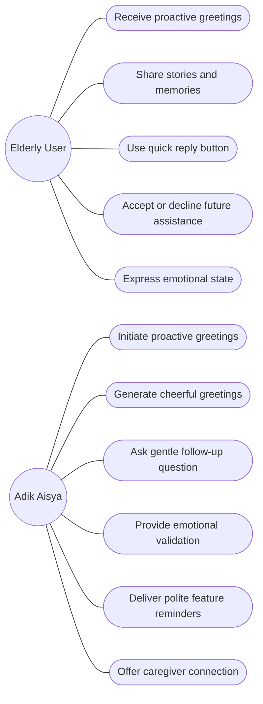
*Figure 3.4.1 - Use cases diagram of Chit-Chat Feature*

### 3.5 Use Cases Consulting

**The Actors**
1. **Primary Actor:** The Elderly User (Atuk / Nenek)
2. **Secondary Actor:** Encik Amirul (AI Companion), Caregiver, System / Server

#### Part A: Consulting with Encik Amirul Description

**Starting a Friendly Conversation**
When Atuk feels lonely or wants someone to talk to, he opens the app and starts a conversation with Encik Amirul. Encik Amirul greets Atuk warmly and invites him to share how he is feeling. Atuk responds naturally by speaking or typing, just like talking to a real person. Encik Amirul listens attentively and encourages Atuk to continue sharing his thoughts.

**Listening and Responding Emotionally**
As Atuk talks, Encik Amirul carefully listens to his words and tone. He responds with empathy, offering comforting and supportive replies. If Atuk sounds worried, sad, or stressed, Encik Amirul acknowledges his emotions and reassures him in a calm and friendly manner. This helps Atuk feel heard and emotionally supported.

**Personalizing the Conversation**
Encik Amirul remembers Atuk's preferences, past conversations, and common topics of interest. Based on this information, he adjusts the conversation style to suit Atuk. For example, Encik Amirul may talk about Atuk's hobbies, daily routines, or previous concerns. This makes the conversation feel more personal and meaningful to Atuk.

**Providing Gentle Reminders**
During the conversation, Encik Amirul may gently remind Atuk about important daily activities such as taking medication, drinking water, or checking his health readings. These reminders are delivered politely, and only when appropriate, so they do not interrupt the natural flow of the conversation. Atuk can acknowledge or postpone the reminder as he prefers.

**Escalating Safety Concerns**
If Encik Amirul detects signs of serious emotional distress, confusion, or potential danger during the conversation, he takes appropriate action. Encik Amirul calmly encourages Atuk to seek help and asks for permission to notify a caregiver. Once consent is given, the system sends an alert to the caregiver with relevant information so that timely assistance can be provided.

#### Part B: Use Case Diagram

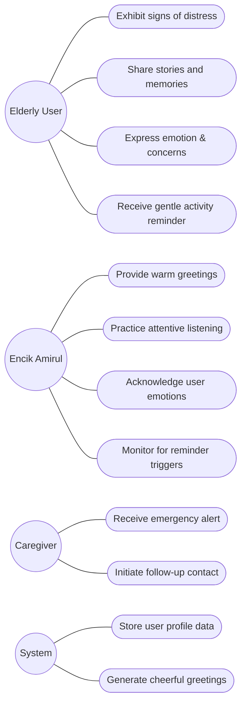
*Figure 3.5.1 - Use cases diagram of Consulting Feature*

---

## 4.0 DESIGN CONSIDERATION

This section describes the key design assumptions, constraints, goals, and development approach that guided the design of the Ingatkan Teman mobile application. These considerations ensure that the system design remains realistic, consistent with user needs, and aligned with the approved proposal and requirements.

### 4.1 Assumptions and Dependencies

- The design of the Ingatkan Teman application is based on several assumptions regarding users, devices, and supporting technologies. It is assumed that users own a smartphone and have basic familiarity with simple actions such as tapping buttons and reading notifications.
- The application assumes that an internet connection is available for AI-powered features such as prescription scanning, conversational interaction, and cloud data synchronization. However, core functions such as viewing medication schedules and marking doses as taken are designed to work offline, with data synchronized once connectivity is restored.
- The system also depends on external services and device capabilities. These include the availability of a working camera for prescription scanning, GPS for locating nearby pharmacies, and notification services provided by the mobile operating system. In addition, the AI features depend on third-party AI and mapping services, which must be accessible and functioning correctly for full system capability.

### 4.2 General Constraints

- Several constraints influence the overall system design. The application must operate on Android and iOS platforms and be compatible with commonly used smartphones, including older devices often used by elderly users. As a result, the design prioritizes lightweight processing and efficient use of system resources.
- Accessibility is a key constraint. The interface must use large, readable text, clearly labelled buttons, and simple navigation to accommodate users with reduced vision or motor control. The design also avoids complex menus or deep navigation structures.
- Safety and ethical constraints are also applied. The system is designed strictly as a support and reminder tool and does not provide medical diagnoses or alter prescribed medication. All health-related guidance remains non-diagnostic and advisory, ensuring that the application does not replace professional healthcare services.

### 4.3 Goals and Guidelines

- The primary design goal of Ingatkan Teman is to feel like a supportive companion rather than a complex technical tool. The application is designed to reduce stress and anxiety by using friendly AI personas that communicate in a calm, respectful, and encouraging manner.
- Design guidelines emphasize simplicity and clarity. Each screen focuses on a small number of important actions, helping elderly users avoid confusion. Feedback is immediate and reassuring, such as confirmation messages or gentle animations, so users feel confident that their actions have been successfully recorded.
- Another important guideline is respect for user autonomy and privacy. Users remain in control of their data and decisions, including whether to share information with caregivers or enable certain features. The system is designed to support users, not to overwhelm or pressure them.

### 4.4 Development Method

- The Ingatkan Teman application is developed using a cross-platform approach to ensure consistency across Android and iOS devices. Flutter is used as the main development framework, allowing a single codebase to support both platforms efficiently.
- An Agile development methodology is adopted to support iterative development and continuous improvement. The system is developed in small, manageable phases, allowing the team to review progress regularly, incorporate feedback, and refine features as needed. This approach supports flexibility while ensuring that core system requirements remain stable throughout development.

---

## 5.0 ARCHITECTURAL STRATEGIES

In this section, the 'big picture' of the application will be described in technical details, starting with the System Architecture visualized by means of a Deployment Diagram and a Component Diagram.

### 5.1 System Architecture (Deployment Diagram)

The deployment diagram below will display how our application, 'Ingatkan Teman', will be deployed and how it will connect to different components outside of its environment to achieve its goals.

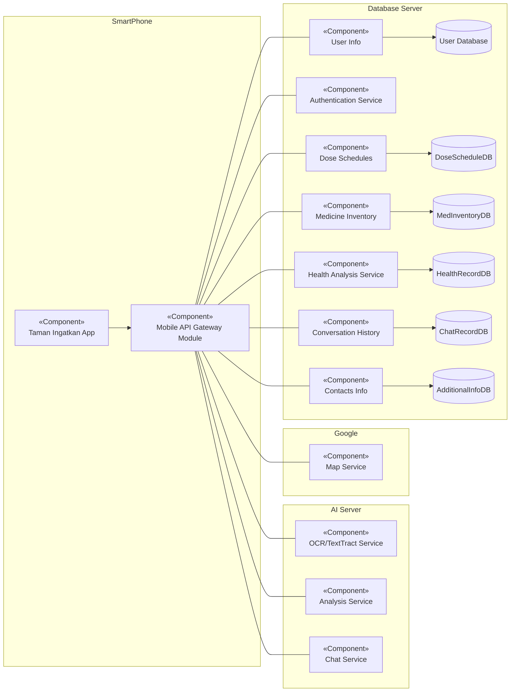
*Figure 5.1.0 : Deployment Diagram of the 'Ingatkan Teman' Application.*

### 5.2 Component Diagram

Component Diagram will present how the components work together by passing different information to each other to complete the system's design structure.

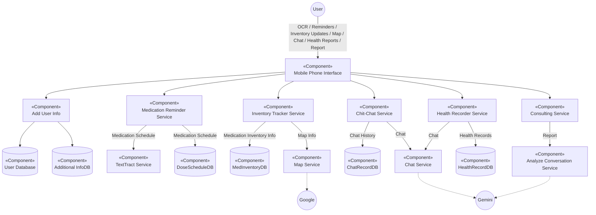
*Figure 5.2.0 : Component Diagram of the 'Ingatkan Teman' Application.*

---

## 6.0 DETAIL DESIGN (The Core Coding Guide)

This section will provide a detailed system design for developers to build the application without encountering difficulties. The section will include precise, systematic details about the project to transform it into real code.

### 6.1 Class Diagram

This section will display the Class UML Diagram of the Application. To avoid confusion and space issues of the document, each class will be displayed individually first, and their connection will follow with a compact figure with shortened UML Classes. The original figure notes that a full networked diagram was also provided as an external link in the source document.

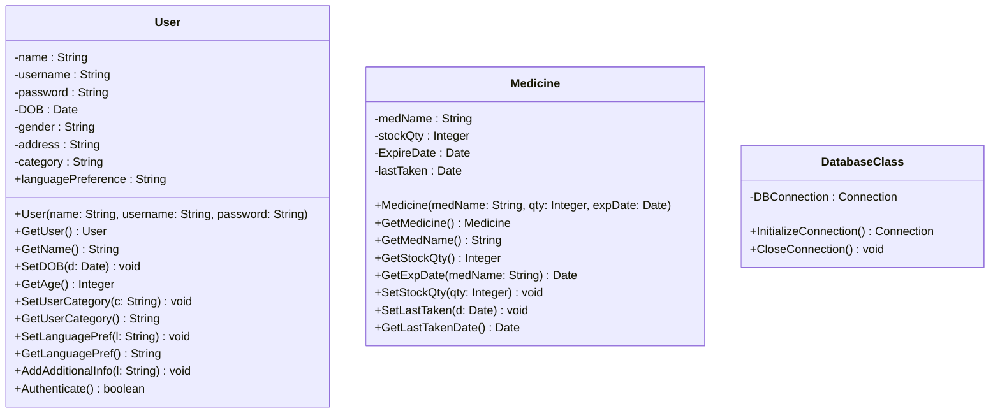
*Figure 6.1.0 : Class Diagram of classes, User, Medicine, and DatabaseClass*

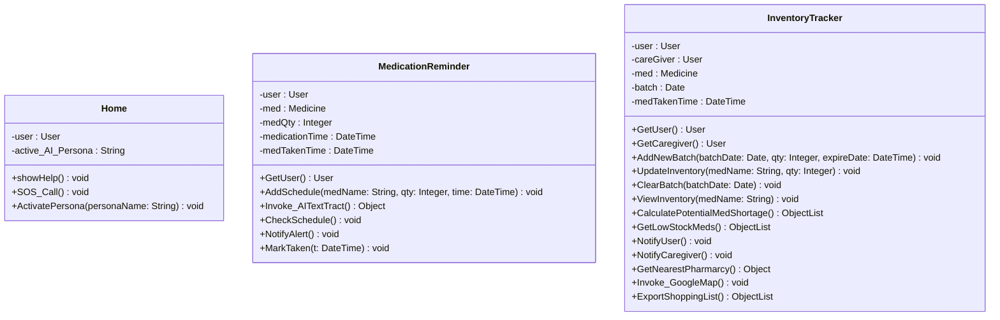
*Figure 6.1.1 : Class Diagram of classes, Home page, Medication Reminder, and Inventory Tracker*

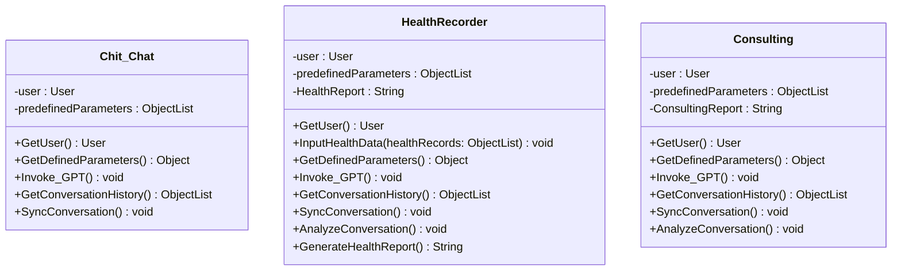
*Figure 6.1.2 : Class Diagram of classes, Chit-Chat, Health Recorder, and Consulting*

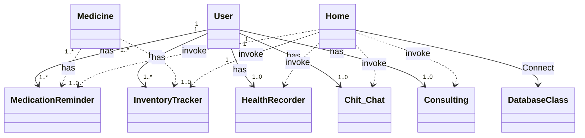
*Figure 6.1.3 / 6.1.4 : Compact and Full UML Model, illustrating the relationships between the classes.*

> **Note:** This compact model combines what was shown across Figures 6.1.3 (compact) and 6.1.4 (full) in the original document, which illustrate how `User` and `Medicine` relate to each of the five feature classes (`MedicationReminder`, `InventoryTracker`, `HealthRecorder`, `Chit_Chat`, `Consulting`), and how `Home` invokes each feature class and connects to `DatabaseClass`.

### 6.2 Sequence Diagrams

#### 6.2.1 Medication Reminder

**Sequence Diagram 1: OCR with AI**

This sequence diagram illustrates how the Medication Reminder module processes a prescription using OCR and AI. The elderly user scans a prescription image using the mobile app, which sends the image to the AI service for text extraction. The extracted medication details are returned, reviewed by the user, and then saved into the database once confirmed.

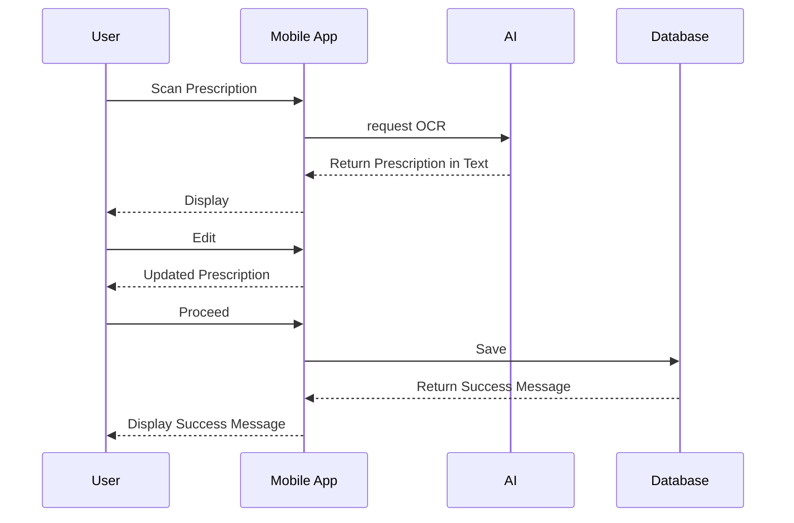
*Figure 6.2.1.1: OCR with AI*

**Sequence Diagram 2: User write Transcription manually**

This sequence diagram shows the manual medication entry process when the user prefers not to scan a prescription. The user enters medication details directly into the application, and the system validates and stores the information in the database. This ensures flexibility for users who may have handwritten prescriptions or unclear images.

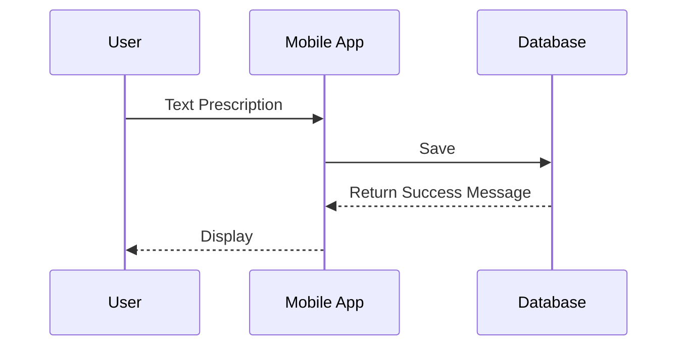
*Figure 6.2.1.2: User write Transcription manually*

**Sequence Diagram 3: "Time to take medication."**

This sequence diagram represents the medication reminder flow at the scheduled time. The system sends a notification to the user, prompting them to take their medication. When the user marks the dose as "Taken," the system records the action, updates the medication history, and deducts the corresponding quantity from the inventory.

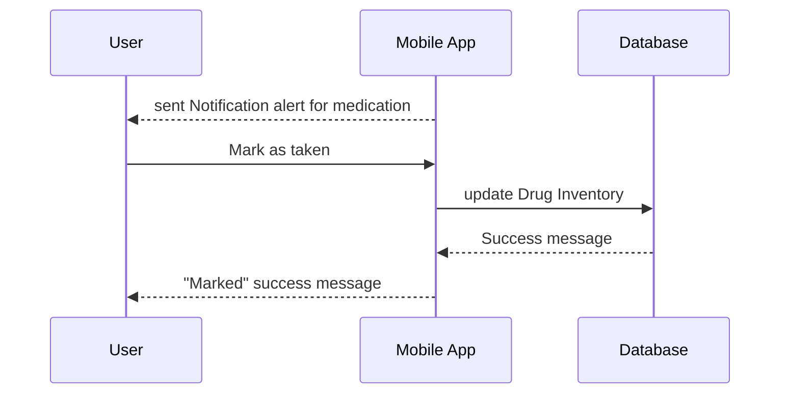
*Figure 6.2.1.3: "Time to take medication."*

**Sequence Diagram 4: "Delay medication."**

This sequence diagram explains how the system handles delayed medication intake. When the reminder notification is triggered, the user may choose to snooze or delay the dose. The system updates the schedule accordingly and sends a confirmation message without applying pressure, maintaining a supportive user experience.

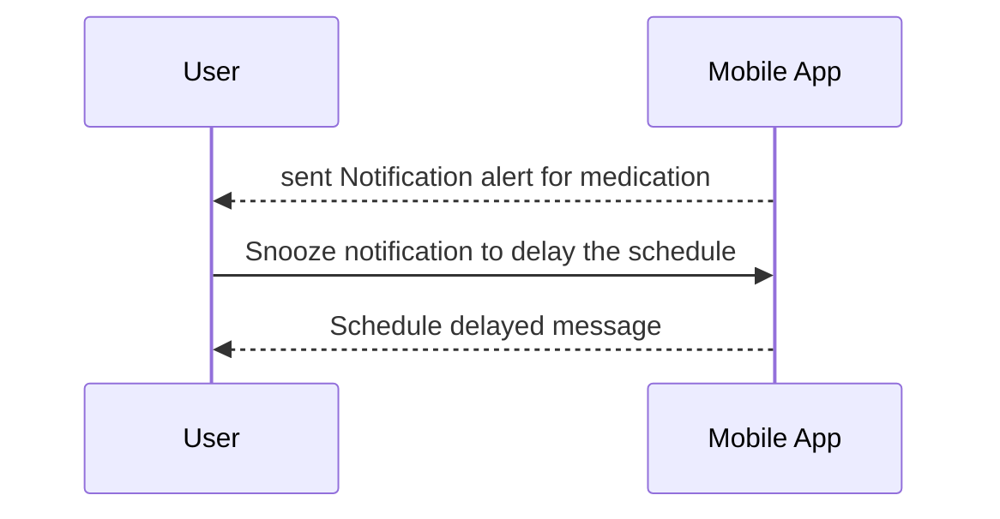
*Figure 6.2.1.4: "Delay medication."*

#### 6.2.2 Medication Inventory Tracker

**Sequence Diagram 1: Manual Stock Adjustment**

This diagram shows the process when an elderly user manually updates their medicine stock quantity. The user opens the inventory screen, enters new quantity details, and the system validates the input before updating the database. The Mobile App first checks the current stock from the Database, then saves the new quantity and creates an audit log entry for tracking purposes. Finally, the user receives a confirmation message that the update was successful.

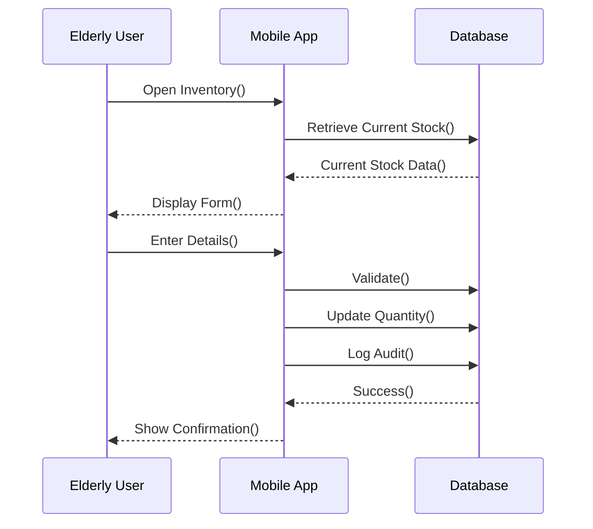
*Figure 6.2.2.1: Manual Stock Adjustment*

**Sequence Diagram 2: Low Stock Alert**

This diagram illustrates the automatic low stock detection and notification system. A background System Checker periodically monitors medicine quantities, calculates how many days of supply remain, and compares against user-configured thresholds. When stock falls below the limit, the system triggers an alert through the Mobile App, which displays a notification to the user. The user then opens the app to view the low-stock dashboard and chooses an appropriate action.

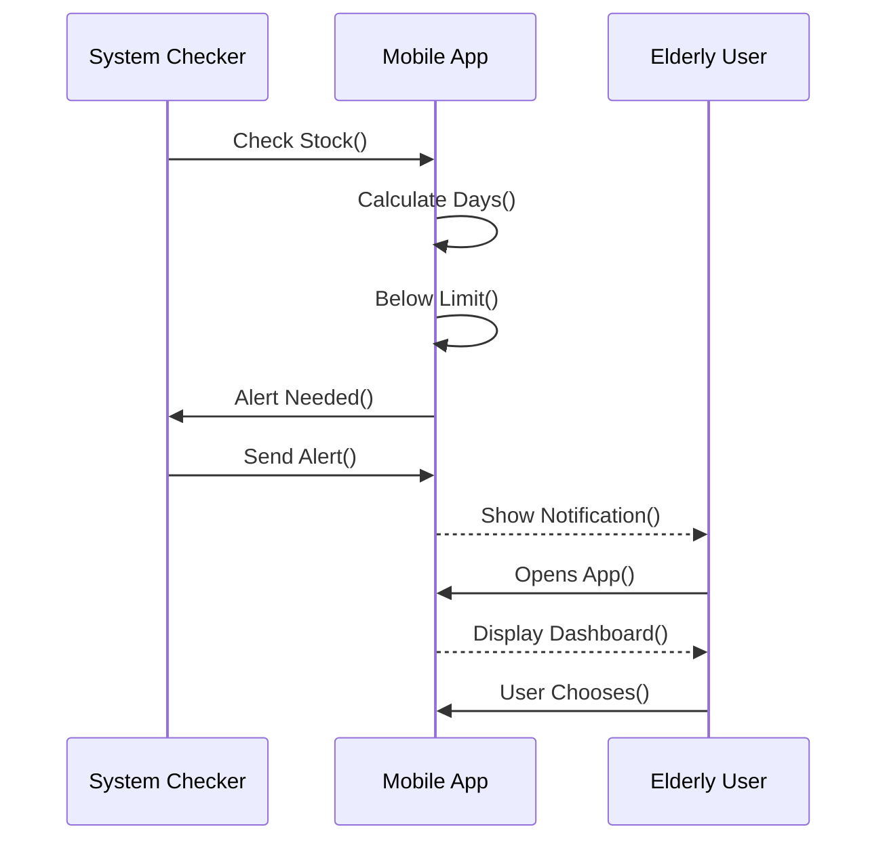
*Figure 6.2.2.2: Low Stock Alert*

**Sequence Diagram 3: Pharmacy Search**

This diagram shows the process of finding nearby pharmacies when medicine stock is low. The user taps the "Find Pharmacies" button, which triggers the Mobile App to get the user's current location via GPS. The app then sends a search request to a Map Service (like Google Maps API), which queries its database for nearby pharmacies and returns a list. The app processes these results and displays them on an interactive map. Finally, the user can select a specific pharmacy to view detailed information.

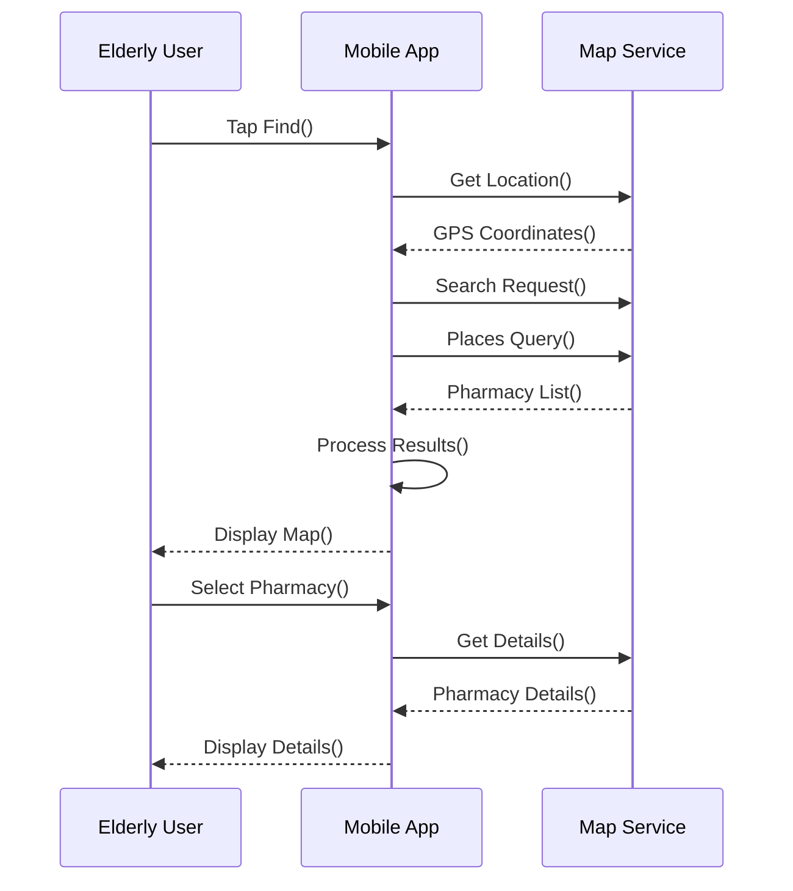
*Figure 6.2.2.3: Pharmacy Search*

#### 6.2.3 Daily Health Recorder

**Sequence Diagram 1: Daily Conversational Health Check-In**

This diagram illustrates the standard daily health logging process using a conversational approach. The elderly user opens the mobile application during the scheduled check-in time. Dr. Fatimah initiates a friendly health prompt, and the user responds using natural language. The Mobile App processes the input, extracts the relevant health data, and stores the structured record in the database. Nurse Alia then provides a supportive confirmation message to the user, ensuring that the health reading has been successfully recorded.

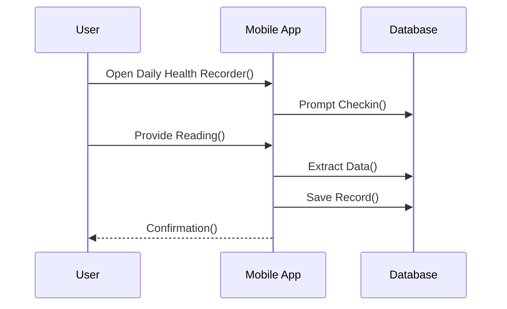
*Figure 6.2.3.1: Daily Health Recorder*

**Sequence Diagram 2: Manual Health Entry with Alert Trigger**

This diagram shows the flow when the elderly user manually enters a health reading, such as a glucose or blood pressure value. After the user submits the reading, the Mobile App validates the input against predefined safety thresholds. If the value is abnormal, the system triggers an alert based on the severity level. Nurse Alia responds by notifying the user with appropriate guidance, and critical alerts may prompt caregiver or emergency notifications. The validated data is saved in the database regardless of alert status.

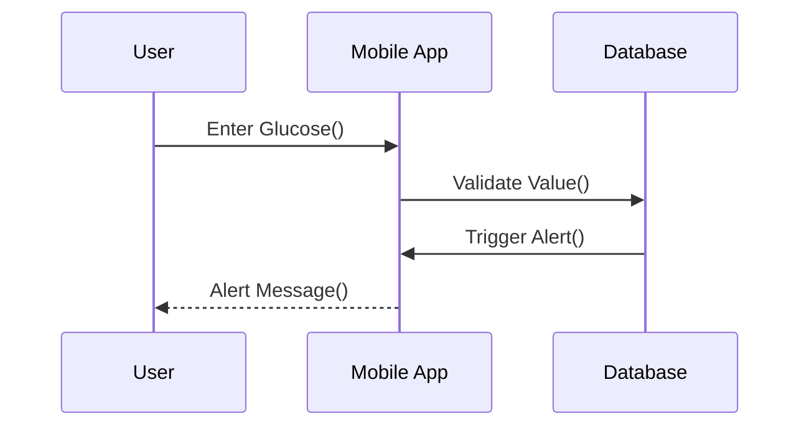
*Figure 6.2.3.2: Manual Health Entry with Alert Trigger*

**Sequence Diagram 3: Request Health History and Trend Analysis**

This diagram represents the process of retrieving historical health data. The elderly user requests a summary or trend analysis for a specific health metric, such as weight or blood pressure. The Mobile App retrieves the relevant records from the database and performs basic statistical analysis. Dr. Fatimah then presents the results to the user in a simple and understandable format, accompanied by visual trend indicators.

```mermaid
sequenceDiagram
    participant User
    participant MobileApp as Mobile App
    participant Database

    User->>MobileApp: Request History()
    MobileApp->>Database: Retrieve Data()
    Database-->>MobileApp: Trend Result()
    MobileApp-->>User: View Analysis()
```
*Figure 6.2.3.3: Request Health History and Trend Analysis*

#### 6.2.4 Chit-Chat

**Sequence Diagram 1: Proactive Friendly Engagement**

This diagram demonstrates how Adik Aisya initiates a friendly conversation when the user has not interacted with the application for a period of time. The Mobile App sends a proactive greeting through the companion persona. The elderly user receives the message and is encouraged to respond using quick reply options, helping to maintain regular engagement and reduce feelings of loneliness.

```mermaid
sequenceDiagram
    participant User
    participant MobileApp as MobileApp
    participant MemoryDB as MemoryDB / ConversationHistoryDB

    User->>MobileApp: interact
    MobileApp->>MemoryDB: fetchHistory
    MemoryDB-->>MobileApp: history
    MobileApp-->>User: Send Special Greetings
```
*Figure 6.2.4.1: Proactive Friendly Engagement*

**Sequence Diagram 2: Casual Conversation with Memory Recall**

This diagram shows a casual chat interaction where the user shares a personal experience. The Mobile App retrieves relevant stored memories, such as preferences or past conversations, from the memory database. Adik Aisya uses this information to generate a personalized and meaningful response, reinforcing emotional connection and trust.

```mermaid
sequenceDiagram
    participant User
    participant MobileApp as Mobile App
    participant MemoryDB as Memory DB

    User->>MobileApp: Share Story()
    MobileApp->>MemoryDB: Retrieve Memory()
    MemoryDB-->>MobileApp: Memory Data()
    MobileApp-->>User: Friendly Reply()
```
*Figure 6.2.4.2: Casual Conversation with Memory Recall*

**Sequence Diagram 3: Emotional Support Interaction**

This diagram illustrates an emotional support scenario. When the elderly user expresses sadness or loneliness, the Mobile App analyzes the message to detect emotional distress. Adik Aisya responds with empathetic and supportive messages while maintaining strict non-medical boundaries. If required, the system remains prepared to escalate the situation based on safety rules.

```mermaid
sequenceDiagram
    participant User
    participant MobileApp as Mobile App

    User->>MobileApp: Express Sadness()
    MobileApp-->>User: Empathetic Reply()
```
*Figure 6.2.4.3: Emotional Support Interaction*

#### 6.2.5 Consulting

**Sequence Diagram 1: Initiating a Consultation Session**

This diagram shows the process of starting a consultation. The elderly user explicitly requests to speak with Encik Amirul. The Mobile App initiates the consultation session, and Encik Amirul greets the user in a calm and professional manner, inviting them to explain their concerns.

```mermaid
sequenceDiagram
    participant User
    participant MobileApp as Mobile App

    User->>MobileApp: Request Consult()
    MobileApp-->>User: Start Session()
```
*Figure 6.2.5.1: Initiating a Consultation Session*

**Sequence Diagram 2: Symptom Description and Clarification**

This diagram represents the core consultation flow where the user describes their symptoms. The Mobile App extracts key information such as symptom type and duration, while Encik Amirul asks follow-up questions to gather more details. The structured consultation notes are then saved into the database for future reference.

```mermaid
sequenceDiagram
    participant User
    participant MobileApp as Mobile App
    participant HealthRecordDB as HealthRecordDB

    User->>MobileApp: describe Symptoms
    MobileApp-->>User: ask Questions
    User->>MobileApp: answer questions
    MobileApp->>HealthRecordDB: SaveNotes
```
*Figure 6.2.5.2: Symptom Description and Clarification*

**Sequence Diagram 3: Session Summary and Recommendations**

This diagram shows how the system concludes a consultation. After the user ends the session, the Mobile App generates a structured summary containing the key findings and general wellness recommendations. Encik Amirul presents the summary to the user, with options to save, export, or share the report with caregivers or clinicians.

```mermaid
sequenceDiagram
    participant User
    participant MobileApp as Mobile App
    participant Database

    User->>MobileApp: End Session()
    MobileApp->>Database: Generate Summary()
    MobileApp->>Database: Save Summary()
    MobileApp-->>User: Display Summary()
```
*Figure 6.2.5.3: Session Summary and Recommendations*

**Sequence Diagram 4: Emergency Escalation**

This diagram illustrates the emergency handling flow. When the user mentions severe or high-risk symptoms, the system immediately detects emergency keywords. The Mobile App displays emergency options such as calling emergency services or notifying caregivers. Encik Amirul clearly instructs the user to seek immediate medical attention while the system triggers the necessary alerts.

```mermaid
sequenceDiagram
    participant User
    participant MobileApp as Mobile App
    participant EmergencyService as Emergency Service

    User->>MobileApp: Severe Symptom()
    MobileApp-->>User: Show Emergency Alert()
    User->>MobileApp: Confirm Call()
    MobileApp->>EmergencyService: Notify Emergency()
```
*Figure 6.2.5.4: Emergency Escalation*

### 6.3 User Interface Design

**UI-1: Login/Splash:** Biometric login (Fingerprint/FaceID) for seniors.


*Figure 6.3.0 : LoginPage UI*

**UI-2: Home Dashboard:** The main hub with big icons for the 5 Features (Medication, Inventory, Health, Chat, Consult).


*Figure 6.3.1 : HomePage UI*

**UI-3: Medication Schedule (Adik Ahmad):** List of today's pills + "Taken" buttons.


*Figure 6.3.2 : Medication Reminder Page UI*

This screen shows the Medication Reminder interface guided by Adik Ahmad. The elderly user can view scheduled medications and respond using simple buttons such as "Sudah" or "Belum", ensuring medication intake is easy to confirm and record.

**UI-4: Camera/OCR View (Adik Ahmad):** The screen where users scan their prescription document.


*Figure 6.3.3 : OCR Feature UI*

From the same screen, the user can tap "TextTract" to scan a prescription or medication label. The system uses OCR and AI to extract medication details and allows the user to review and confirm the information before saving.

**UI-5: Inventory Tracker (PakCik Firdaus):** List of remaining stock.


*Figure 6.3.4 : Medication Inventory UI*

**UI-6: Pharmacy Map (PakCik Firdaus):** Map view showing nearby pharmacies when stock is low.


*Figure 6.3.5 : Nearest Pharmacy UI*

**UI-7: Chit-Chat Room (Adik Aisya):** A friendly chat interface (like WhatsApp but simpler) for casual talk.


*Figure 6.3.6 : Chit-Chat Page UI*

**UI-8: Consultation Report (Encik Amirul):** The summary screen shown after a consultation session.


*Figure 6.3.7 : Consulting Page UI*

**UI-9: Daily Health Recorder (Dr. Fatima & Miss Alia):** Chat and Health Recording Hybrid feature.


*Figure 6.3.8 : Daily Health Recorder Page UI*

---

## 7.0 GLOSSARY

This glossary provides clear definitions of key terms and abbreviations used throughout this Software Design Document. It is intended to help readers, especially non-technical stakeholders, understand the technical and design concepts discussed in this report.

| Term / Acronym | Definition |
|---|---|
| AI (Artificial Intelligence) | The capability of a computer system to perform tasks that normally require human intelligence, such as understanding language, responding to questions, and providing assistance. |
| Agile Methodology | A software development approach that focuses on iterative development, frequent feedback, and continuous improvement throughout the project lifecycle. |
| API (Application Programming Interface) | A set of rules that allows different software components or systems to communicate and exchange data with each other. |
| Caregiver | A family member, nurse, or trusted individual who is authorized by the user to receive notifications or view selected health-related information. |
| CRUD | Basic database operations: Create, Read, Update, and Delete. |
| Flutter | A cross-platform mobile application development framework used to build applications for both Android and iOS using a single codebase. |
| NLP (Natural Language Processing) | A branch of artificial intelligence that enables systems to understand and process human language in text or speech form. |
| OCR (Optical Character Recognition) | Technology used to convert text from images, such as printed prescriptions, into machine-readable digital text. |
| Persona | A fictional character used in the application to guide the tone, behaviour, and interaction style of the AI assistant (e.g., Adik Ahmad, Adik Aisya). |
| SDD (Software Design Document) | A document that explains how a software system will be designed and implemented, focusing on structure and technical decisions. |
| SRS (Software Requirements Specification) | A document that defines what a software system must do, including its functional and non-functional requirements. |
| TTS (Text-to-Speech) | A feature that converts written text into spoken audio to support users who prefer listening rather than reading. |
| UI (User Interface) | The visual components of the application that users interact with, such as buttons, text, icons, and screens. |
| UX (User Experience) | The overall experience and satisfaction a user has when interacting with the application. |
| Offline Mode | A system state where core functions remain usable without an internet connection, with data synchronized later when connectivity is restored. |
